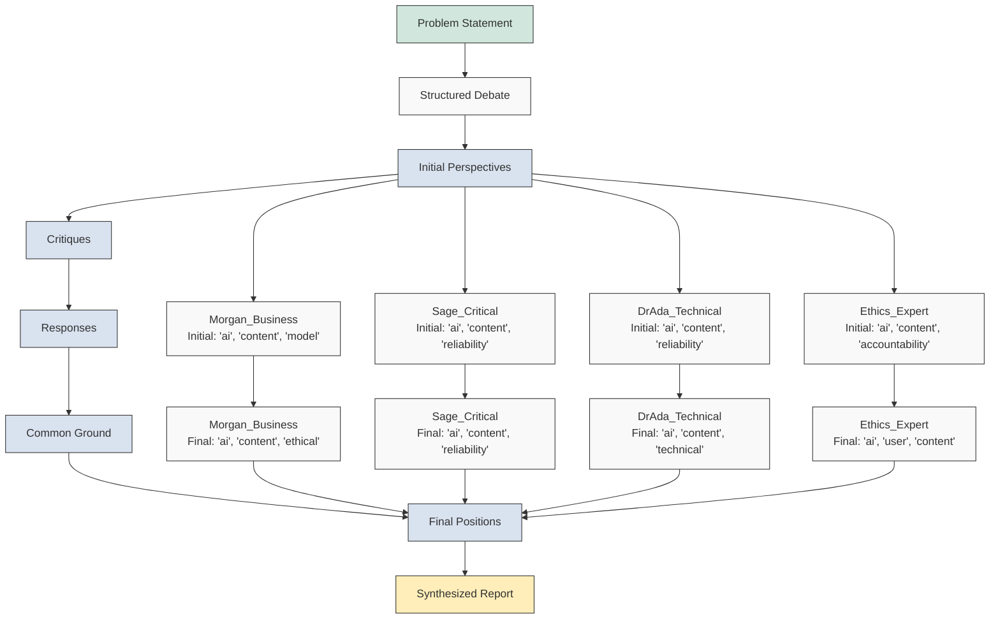

# Debate Flow Diagram

```mermaid

graph TD
    Problem[Problem Statement] --> Debate[Structured Debate]
    Debate --> Perspectives[Initial Perspectives]
    Perspectives --> Critiques[Critiques]
    Critiques --> Responses[Responses]
    Responses --> CommonGround[Common Ground]
    CommonGround --> FinalPositions[Final Positions]
    FinalPositions --> Report[Synthesized Report]
    
    classDef default fill:#f9f9f9,stroke:#333,stroke-width:1px;
    classDef problem fill:#d1e7dd,stroke:#333,stroke-width:1px;
    classDef phase fill:#d9e2ef,stroke:#333,stroke-width:1px;
    classDef report fill:#ffeeba,stroke:#333,stroke-width:1px;
    
    class Problem problem;
    class Perspectives,Critiques,Responses,CommonGround,FinalPositions phase;
    class Report report;
    
    %% Agent Evolution
    Morgan_Business_initial[Morgan_Business<br>Initial: 'ai', 'content', 'model']
    Morgan_Business_final[Morgan_Business<br>Final: 'ai', 'content', 'ethical']
    Morgan_Business_initial --> Morgan_Business_final
    Perspectives --> Morgan_Business_initial
    Morgan_Business_final --> FinalPositions
    Sage_Critical_initial[Sage_Critical<br>Initial: 'ai', 'content', 'reliability']
    Sage_Critical_final[Sage_Critical<br>Final: 'ai', 'content', 'reliability']
    Sage_Critical_initial --> Sage_Critical_final
    Perspectives --> Sage_Critical_initial
    Sage_Critical_final --> FinalPositions
    DrAda_Technical_initial[DrAda_Technical<br>Initial: 'ai', 'content', 'reliability']
    DrAda_Technical_final[DrAda_Technical<br>Final: 'ai', 'content', 'technical']
    DrAda_Technical_initial --> DrAda_Technical_final
    Perspectives --> DrAda_Technical_initial
    DrAda_Technical_final --> FinalPositions
    Ethics_Expert_initial[Ethics_Expert<br>Initial: 'ai', 'content', 'accountability']
    Ethics_Expert_final[Ethics_Expert<br>Final: 'ai', 'user', 'content']
    Ethics_Expert_initial --> Ethics_Expert_final
    Perspectives --> Ethics_Expert_initial
    Ethics_Expert_final --> FinalPositions

```