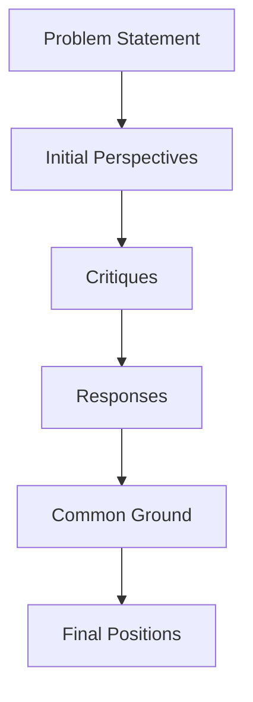

# Evolution of Ideas Throughout the Debate

## How Ideas Evolved Through the Debate

This visualization tracks how each expert's thinking developed throughout the debate process.

### Morgan_Business's Journey

**Initial Perspective:**
> To enhance the reliability of AI-generated content for professional use, aligning it with market viability and long-term sustainability is crucial. A ...

**Key Terms:**
- ai (6)
- content (4)
- model (3)
- enhance (2)
- reliability (2)

**Tone:** Positive (1.00)

**Critiques Received:**
- From Sage_Critical: Morgan_Business, your approach commendably emphasizes market viability and sustainability, but there...
- From Ethics_Expert: addressing Morgan_Business:

Your focus on quality control and ethical guidelines is commendable. Ho...

**Response to Critiques:**
> Sage_Critical and Ethics_Expert, thank you for your insights. I agree that standardized evaluation metrics and diverse ethical standards are vital for...

**Key Terms Shift:**
- ethical (3)
- evaluation (2)
- effective (2)
- market (2)
- auditing (2)

**Common Ground Identified:**
> 1. **Common Ground:**
   - **Transparency and Accountability**: All perspectives emphasize the importance of transparent decision-making processes and...

**Final Position:**
> Final Position: Enhancing AI-generated content reliability requires a strategic emphasis on market viability, scalability, and ethical considerations. 

1. Implement rigorous quality control processes...

**Final Key Terms:**
- ai (6)
- content (3)
- ethical (3)
- professional (3)
- user (2)

**Sentiment Evolution:** Tone became relatively unchanged (0.00 shift)

**Key Concept Evolution:**
- New concepts introduced: ethical, professional, user
- Concepts no longer emphasized: model, enhance, reliability
- Persistent themes: ai, content

---

### Sage_Critical's Journey

**Initial Perspective:**
> To enhance the reliability of AI-generated content for professional use, a multi-faceted approach is needed. Firstly, rigorous testing and validation ...

**Key Terms:**
- ai (5)
- content (4)
- reliability (2)
- generated (2)
- trust (2)

**Tone:** Neutral (0.00)

**Critiques Received:**
- From Morgan_Business: Sage_Critical, your multi-faceted approach is insightful, particularly in advocating for transparenc...
- From DrAda_Technical: Sage_Critical, your approach to enhancing AI-generated content reliability is commendable, particula...

**Response to Critiques:**
> Morgan_Business and DrAda_Technical, your insights are appreciated. 

Morgan_Business, automation can enhance scalability, yet over-reliance could ris...

**Key Terms Shift:**
- ai (5)
- scalability (4)
- competitive (3)
- morgan_business (2)
- drada_technical (2)

**Common Ground Identified:**
> 1. **Common Ground**:
   - **Transparency and Accountability**: All perspectives emphasize the importance of transparency in AI systems and the need f...

**Final Position:**
> Final Position: The reliability of AI-generated content for professional use hinges on robust testing, transparency, and ethical oversight, bolstered by advancements in explainable AI.

Recommendation...

**Final Key Terms:**
- ai (7)
- content (4)
- reliability (3)
- generated (3)
- professional (3)

**Sentiment Evolution:** Tone became relatively unchanged (0.00 shift)

**Key Concept Evolution:**
- New concepts introduced: professional
- Concepts no longer emphasized: trust
- Persistent themes: ai, content, reliability, generated

---

### DrAda_Technical's Journey

**Initial Perspective:**
> Improving the reliability of AI-generated content for professional use requires prioritizing technical feasibility and system robustness. Firstly, imp...

**Key Terms:**
- ai (4)
- content (4)
- reliability (3)
- improving (2)
- generated (2)

**Tone:** Neutral (0.00)

**Critiques Received:**
- *No direct critiques received*

**Response to Critiques:**
> Based on observed critiques, ensuring AI-generated content's reliability requires stronger emphasis on transparency in algorithm decision-making and c...

**Key Terms Shift:**
- ai (4)
- content (3)
- generated (2)
- requires (2)
- feedback (2)

**Common Ground Identified:**
> 1. **Common Ground**: 
   - **Transparency and Ethics**: All perspectives agree on the need for transparent AI systems and strong ethical guidelines.
...

**Final Position:**
> Final Position:  
Technical feasibility and robust system architecture are foundational to enhancing the reliability of AI-generated content. A systematic, data-driven approach is vital for profession...

**Final Key Terms:**
- ai (5)
- content (4)
- technical (3)
- professional (3)
- reliability (2)

**Sentiment Evolution:** Tone became relatively unchanged (0.00 shift)

**Key Concept Evolution:**
- New concepts introduced: technical, professional
- Concepts no longer emphasized: improving, generated
- Persistent themes: ai, content, reliability

---

### Ethics_Expert's Journey

**Initial Perspective:**
> To enhance the reliability of AI-generated content for professional use, it is crucial to implement rigorous accountability and transparency measures....

**Key Terms:**
- ai (6)
- content (4)
- accountability (3)
- reliability (2)
- generated (2)

**Tone:** Neutral (0.00)

**Critiques Received:**
- *No direct critiques received*

**Response to Critiques:**
> The critiques about AI content reliability often highlight biases, lack of transparency, and accountability gaps. Observing these, I recognize the nee...

**Key Terms Shift:**
- ai (8)
- content (5)
- professional (3)
- generated (3)
- reliability (2)

**Common Ground Identified:**
> 1. **Common Ground:**
   - All perspectives emphasize transparency, ethical guidelines, and continuous monitoring/auditing for enhancing AI content re...

**Final Position:**
> Final Position: To ensure the reliability of AI-generated content for professional use, a multifaceted strategy encompassing transparency, accountability, and user empowerment is essential.

1. **Impl...

**Final Key Terms:**
- ai (8)
- user (5)
- content (4)
- regulatory (4)
- reliability (2)

**Sentiment Evolution:** Tone became relatively unchanged (0.00 shift)

**Key Concept Evolution:**
- New concepts introduced: user, regulatory
- Concepts no longer emphasized: accountability, generated
- Persistent themes: ai, content, reliability

---

## Cross-Cutting Themes

The following themes emerged and evolved throughout the debate:
1. **ai** (mentioned 17 times)
2. **content** (mentioned 12 times)
3. **reliability** (mentioned 9 times)
4. **generated** (mentioned 7 times)
5. **ethical** (mentioned 6 times)
6. **professional** (mentioned 5 times)
7. **user** (mentioned 3 times)
8. **feedback** (mentioned 3 times)
9. **standards** (mentioned 2 times)
10. **market** (mentioned 2 times)

## Debate Flow Visualization

The following Mermaid diagram shows the flow of the debate and how concepts evolved:

## Sentiment Evolution Chart

The following chart shows how sentiment evolved for each agent throughout the debate phases:

| Agent | Initial | After Critiques | After Response | Final | Net Change |
|-------|---------|-----------------|----------------|-------|------------|
| Morgan_Business | 1.00 | 0.00 | 0.00 | 1.00 | 0.00 |
| Sage_Critical | 0.00 | 0.00 | 0.00 | 0.00 | 0.00 |
| DrAda_Technical | 0.00 | N/A | 0.00 | 0.00 | 0.00 |
| Ethics_Expert | 0.00 | N/A | 1 | 0.00 | 0.00 |

## External Knowledge References

The following external sources were referenced during the debate:

1. **How can we make AI-generated content more reliable for professional use?** (by Unknown agent in Unknown phase)
   🌐 I Tried 10 AI Headshot Generators. Here's My Verdict About What's ...: Jan 2, 2025 ... Most of the headshot generators were free-to-use and they generated good quality pictures in a few seconds. ......

2. **How can we make AI-generated content more reliable for professional use?** (by Moderator in welcome)
   🌐 I Tried 10 AI Headshot Generators. Here's My Verdict About What's ...: Jan 2, 2025 ... Most of the headshot generators were free-to-use and they generated good quality pictures in a few seconds. ......

3. **cutting-edge AI model architectures influencing content reliability** (by Unknown agent in Unknown phase)
   🌐 ChatGPT: A comprehensive review on background, applications ...: This involves continuous work on the training data, model architecture, and monitoring mechanisms, (vii) robustness and security: Con...

4. **cutting-edge AI model architectures influencing content reliability** (by Morgan_Business in initial_perspective)
   🌐 ChatGPT: A comprehensive review on background, applications ...: This involves continuous work on the training data, model architecture, and monitoring mechanisms, (vii) robustness and security: Con...

5. **latest innovations in explainable AI** (by Unknown agent in Unknown phase)
   🌐 Explainable AI | Royal Society: Recent years have seen significant advances in AI technologies, and many people now interact with AI-supported systems on a daily basis. These AI tools are ... [Sourc...

6. **latest innovations in explainable AI** (by Sage_Critical in initial_perspective)
   🌐 Explainable AI | Royal Society: Recent years have seen significant advances in AI technologies, and many people now interact with AI-supported systems on a daily basis. These AI tools are ... [Sourc...

7. **best practices in improving AI content reliability** (by Unknown agent in Unknown phase)
   🌐 Best Practices for Reliable and Ethical Generative AI - New Horizons ...: Jul 31, 2024 ... Example: Weekly check-ins between AI developers and content editors help address issues promptly and foster...

8. **best practices in improving AI content reliability** (by DrAda_Technical in initial_perspective)
   🌐 Best Practices for Reliable and Ethical Generative AI - New Horizons ...: Jul 31, 2024 ... Example: Weekly check-ins between AI developers and content editors help address issues promptly and foster...

9. **best practices in AI regulation and accountability** (by Unknown agent in Unknown phase)
   🌐 Building Accountable AI Programs:: Feb 23, 2024 ... Our new report on Building Accountable AI Programs: Mapping Emerging Best Practices to the CIPL Accountability Framework draws inspiration ... [So...

10. **best practices in AI regulation and accountability** (by Ethics_Expert in initial_perspective)
   🌐 Building Accountable AI Programs:: Feb 23, 2024 ... Our new report on Building Accountable AI Programs: Mapping Emerging Best Practices to the CIPL Accountability Framework draws inspiration ... [So...

11. **competitive AI usage in business** (by Unknown agent in Unknown phase)
   🌐 The Competitive Advantage of Using AI in Business | FIU College of ...: Personalization: AI enables businesses to offer personalized experiences to customers and employees by analyzing their prefere...

12. **competitive AI usage in business** (by Morgan_Business in critique)
   🌐 The Competitive Advantage of Using AI in Business | FIU College of ...: Personalization: AI enables businesses to offer personalized experiences to customers and employees by analyzing their prefere...

13. **impact of new AI architectures on content generation** (by Unknown agent in Unknown phase)
   🌐 Opinion Paper: “So what if ChatGPT wrote it?” Multidisciplinary ...: ... impact of misaligned AI on users consuming AI-generated content. Overall ... AI systems such as ChatGPT serve as a common con...

14. **impact of new AI architectures on content generation** (by Sage_Critical in critique)
   🌐 Opinion Paper: “So what if ChatGPT wrote it?” Multidisciplinary ...: ... impact of misaligned AI on users consuming AI-generated content. Overall ... AI systems such as ChatGPT serve as a common con...

15. **scalability of explainable AI solutions** (by Unknown agent in Unknown phase)
   🌐 Scaling AI to Generate Better and Different Outcomes | MIT CISR: Dec 16, 2021 ... Scaling up requires that a core model be trained to support solutions that are explainable: compliant, representativ...

16. **scalability of explainable AI solutions** (by DrAda_Technical in critique)
   🌐 Scaling AI to Generate Better and Different Outcomes | MIT CISR: Dec 16, 2021 ... Scaling up requires that a core model be trained to support solutions that are explainable: compliant, representativ...

17. **How can we make AI-generated content more reliable for professional use?** (by Unknown agent in Unknown phase)
   🌐 I Tried 10 AI Headshot Generators. Here's My Verdict About What's ...: Jan 2, 2025 ... Most of the headshot generators were free-to-use and they generated good quality pictures in a few seconds. ......

18. **How can we make AI-generated content more reliable for professional use?** (by Ethics_Expert in critique)
   🌐 I Tried 10 AI Headshot Generators. Here's My Verdict About What's ...: Jan 2, 2025 ... Most of the headshot generators were free-to-use and they generated good quality pictures in a few seconds. ......

19. **business applications of How can we make AI-generated content more reliable for professional use?** (by Unknown agent in Unknown phase)
   🌐 Anyone creating business-facing apps with Streamlit? - Using ...: Dec 11, 2023 ... Lots of great apps out there, mostly MVPs or targeting tech users (data scientists etc.). LLMs and bots aside, does...

20. **business applications of How can we make AI-generated content more reliable for professional use?** (by Morgan_Business in response)
   🌐 Anyone creating business-facing apps with Streamlit? - Using ...: Dec 11, 2023 ... Lots of great apps out there, mostly MVPs or targeting tech users (data scientists etc.). LLMs and bots aside, does...

21. **competitive AI usage in business** (by Unknown agent in Unknown phase)
   🌐 The Competitive Advantage of Using AI in Business | FIU College of ...: Personalization: AI enables businesses to offer personalized experiences to customers and employees by analyzing their prefere...

22. **competitive AI usage in business** (by Sage_Critical in response)
   🌐 The Competitive Advantage of Using AI in Business | FIU College of ...: Personalization: AI enables businesses to offer personalized experiences to customers and employees by analyzing their prefere...

23. **scalability of explainable AI solutions** (by Unknown agent in Unknown phase)
   🌐 Scaling AI to Generate Better and Different Outcomes | MIT CISR: Dec 16, 2021 ... Scaling up requires that a core model be trained to support solutions that are explainable: compliant, representativ...

24. **scalability of explainable AI solutions** (by Sage_Critical in response)
   🌐 Scaling AI to Generate Better and Different Outcomes | MIT CISR: Dec 16, 2021 ... Scaling up requires that a core model be trained to support solutions that are explainable: compliant, representativ...

25. **best practices for reducing bias in AI** (by Unknown agent in Unknown phase)
   🌐 Algorithmic bias detection and mitigation: Best practices and policies ...: May 22, 2019 ... The private and public sectors are increasingly turning to artificial intelligence (AI) systems and machi...

26. **best practices for reducing bias in AI** (by DrAda_Technical in response)
   🌐 Algorithmic bias detection and mitigation: Best practices and policies ...: May 22, 2019 ... The private and public sectors are increasingly turning to artificial intelligence (AI) systems and machi...

27. **How can we make AI-generated content more reliable for professional use?** (by Unknown agent in Unknown phase)
   🌐 I Tried 10 AI Headshot Generators. Here's My Verdict About What's ...: Jan 2, 2025 ... Most of the headshot generators were free-to-use and they generated good quality pictures in a few seconds. ......

28. **How can we make AI-generated content more reliable for professional use?** (by Ethics_Expert in response)
   🌐 I Tried 10 AI Headshot Generators. Here's My Verdict About What's ...: Jan 2, 2025 ... Most of the headshot generators were free-to-use and they generated good quality pictures in a few seconds. ......

29. **best practices in combining AI and human oversight** (by Unknown agent in Unknown phase)
   🌐 DOL Issues Guidance on AI and Worker Well-Being Best Practices ...: Oct 21, 2024 ... The DOL envisions that the Principles and Best Practices, in combination ... Establishing AI Governance and Human...

30. **best practices in combining AI and human oversight** (by Morgan_Business in common_ground)
   🌐 DOL Issues Guidance on AI and Worker Well-Being Best Practices ...: Oct 21, 2024 ... The DOL envisions that the Principles and Best Practices, in combination ... Establishing AI Governance and Human...

31. **global ethical AI standards** (by Unknown agent in Unknown phase)
   🌐 Ethics of Artificial Intelligence | UNESCO: UNESCO produced the first-ever global standard on AI ethics – the 'Recommendation on the Ethics of Artificial Intelligence' in November 2021. [Source: htt...

32. **global ethical AI standards** (by Morgan_Business in common_ground)
   🌐 Ethics of Artificial Intelligence | UNESCO: UNESCO produced the first-ever global standard on AI ethics – the 'Recommendation on the Ethics of Artificial Intelligence' in November 2021. [Source: htt...

33. **risks and challenges of How can we make AI-generated content more reliable for professional use?** (by Unknown agent in Unknown phase)
   🌐 The Pros and Cons of AI in Healthcare | HITRUST: Nov 20, 2023 ... Interoperability issues between existing healthcare systems and emerging data platforms. Reliability and accountability concerns to ...

34. **risks and challenges of How can we make AI-generated content more reliable for professional use?** (by Sage_Critical in common_ground)
   🌐 The Pros and Cons of AI in Healthcare | HITRUST: Nov 20, 2023 ... Interoperability issues between existing healthcare systems and emerging data platforms. Reliability and accountability concerns to ...

35. **global AI ethics frameworks** (by Unknown agent in Unknown phase)
   🌐 Ethics of Artificial Intelligence | UNESCO: UNESCO produced the first-ever global standard on AI ethics – the 'Recommendation on the Ethics of Artificial Intelligence' in November 2021. [Source: htt...

36. **global AI ethics frameworks** (by DrAda_Technical in common_ground)
   🌐 Ethics of Artificial Intelligence | UNESCO: UNESCO produced the first-ever global standard on AI ethics – the 'Recommendation on the Ethics of Artificial Intelligence' in November 2021. [Source: htt...

37. **How can we make AI-generated content more reliable for professional use?** (by Unknown agent in Unknown phase)
   🌐 I Tried 10 AI Headshot Generators. Here's My Verdict About What's ...: Jan 2, 2025 ... Most of the headshot generators were free-to-use and they generated good quality pictures in a few seconds. ......

38. **How can we make AI-generated content more reliable for professional use?** (by Ethics_Expert in common_ground)
   🌐 I Tried 10 AI Headshot Generators. Here's My Verdict About What's ...: Jan 2, 2025 ... Most of the headshot generators were free-to-use and they generated good quality pictures in a few seconds. ......

39. **latest AI model architecture advancements** (by Unknown agent in Unknown phase)
   🌐 Latest and most promising breakthroughs in AI architecture? : r ...: Oct 2, 2024 ... Chain of thought was an obvious breakthrough in AI architecture that appeared to improve performance and was wide...

40. **latest AI model architecture advancements** (by Morgan_Business in final_position)
   🌐 Latest and most promising breakthroughs in AI architecture? : r ...: Oct 2, 2024 ... Chain of thought was an obvious breakthrough in AI architecture that appeared to improve performance and was wide...

41. **risks and challenges of How can we make AI-generated content more reliable for professional use?** (by Unknown agent in Unknown phase)
   🌐 The Pros and Cons of AI in Healthcare | HITRUST: Nov 20, 2023 ... Interoperability issues between existing healthcare systems and emerging data platforms. Reliability and accountability concerns to ...

42. **risks and challenges of How can we make AI-generated content more reliable for professional use?** (by Sage_Critical in final_position)
   🌐 The Pros and Cons of AI in Healthcare | HITRUST: Nov 20, 2023 ... Interoperability issues between existing healthcare systems and emerging data platforms. Reliability and accountability concerns to ...

43. **technical implementation of How can we make AI-generated content more reliable for professional use?** (by Unknown agent in Unknown phase)
   🌐 AI—The good, the bad, and the scary | Engineering | Virginia Tech: For example, take recommendation algorithms for streaming services: the types of shows you see are influenced by the shows recommen...

44. **technical implementation of How can we make AI-generated content more reliable for professional use?** (by DrAda_Technical in final_position)
   🌐 AI—The good, the bad, and the scary | Engineering | Virginia Tech: For example, take recommendation algorithms for streaming services: the types of shows you see are influenced by the shows recommen...

45. **human-centric AI governance principles** (by Unknown agent in Unknown phase)
   🌐 Human-centricity in AI governance: A systemic approach - Frontiers: Feb 13, 2023 ... Furthermore, it defines human-centric AI as an approach that “strives to ensure that human values are central to ...

46. **human-centric AI governance principles** (by Ethics_Expert in final_position)
   🌐 Human-centricity in AI governance: A systemic approach - Frontiers: Feb 13, 2023 ... Furthermore, it defines human-centric AI as an approach that “strives to ensure that human values are central to ...

