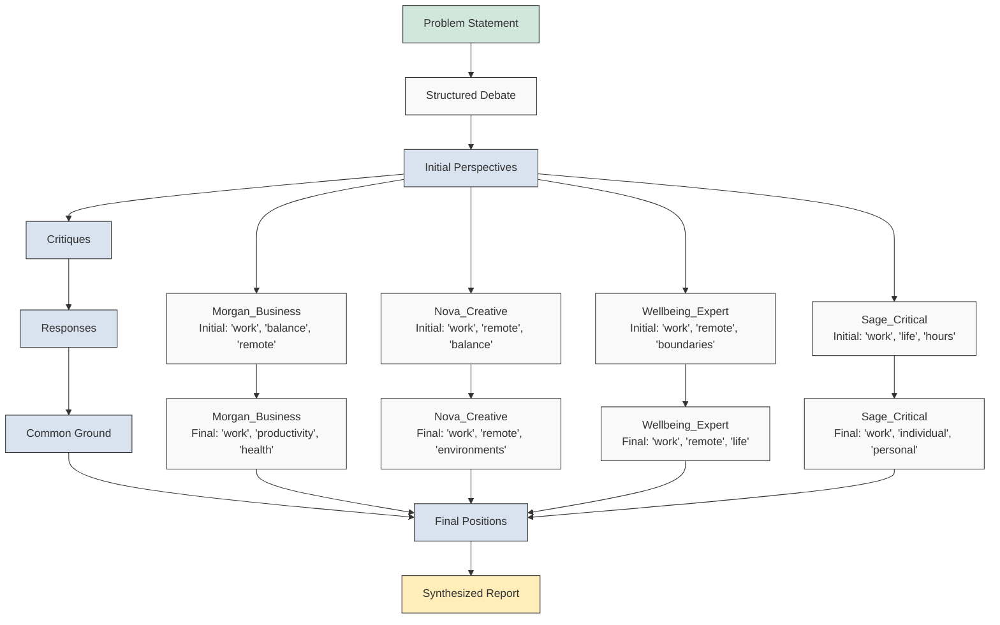

# Debate Flow Diagram

```mermaid

graph TD
    Problem[Problem Statement] --> Debate[Structured Debate]
    Debate --> Perspectives[Initial Perspectives]
    Perspectives --> Critiques[Critiques]
    Critiques --> Responses[Responses]
    Responses --> CommonGround[Common Ground]
    CommonGround --> FinalPositions[Final Positions]
    FinalPositions --> Report[Synthesized Report]
    
    classDef default fill:#f9f9f9,stroke:#333,stroke-width:1px;
    classDef problem fill:#d1e7dd,stroke:#333,stroke-width:1px;
    classDef phase fill:#d9e2ef,stroke:#333,stroke-width:1px;
    classDef report fill:#ffeeba,stroke:#333,stroke-width:1px;
    
    class Problem problem;
    class Perspectives,Critiques,Responses,CommonGround,FinalPositions phase;
    class Report report;
    
    %% Agent Evolution
    Morgan_Business_initial[Morgan_Business<br>Initial: 'work', 'balance', 'remote']
    Morgan_Business_final[Morgan_Business<br>Final: 'work', 'productivity', 'health']
    Morgan_Business_initial --> Morgan_Business_final
    Perspectives --> Morgan_Business_initial
    Morgan_Business_final --> FinalPositions
    Nova_Creative_initial[Nova_Creative<br>Initial: 'work', 'remote', 'balance']
    Nova_Creative_final[Nova_Creative<br>Final: 'work', 'remote', 'environments']
    Nova_Creative_initial --> Nova_Creative_final
    Perspectives --> Nova_Creative_initial
    Nova_Creative_final --> FinalPositions
    Wellbeing_Expert_initial[Wellbeing_Expert<br>Initial: 'work', 'remote', 'boundaries']
    Wellbeing_Expert_final[Wellbeing_Expert<br>Final: 'work', 'remote', 'life']
    Wellbeing_Expert_initial --> Wellbeing_Expert_final
    Perspectives --> Wellbeing_Expert_initial
    Wellbeing_Expert_final --> FinalPositions
    Sage_Critical_initial[Sage_Critical<br>Initial: 'work', 'life', 'hours']
    Sage_Critical_final[Sage_Critical<br>Final: 'work', 'individual', 'personal']
    Sage_Critical_initial --> Sage_Critical_final
    Perspectives --> Sage_Critical_initial
    Sage_Critical_final --> FinalPositions

```