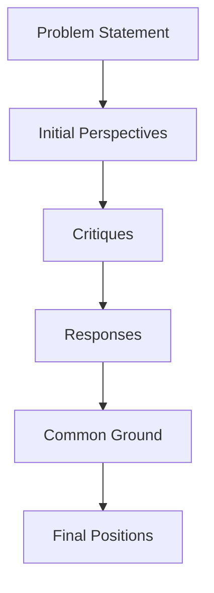

# Evolution of Ideas Throughout the Debate

## How Ideas Evolved Through the Debate

This visualization tracks how each expert's thinking developed throughout the debate process.

### Morgan_Business's Journey

**Initial Perspective:**
> In remote work settings, optimizing work-life balance is crucial for both employee satisfaction and productivity. Strategically, companies should impl...

**Key Terms:**
- work (5)
- balance (4)
- remote (2)
- productivity (2)
- hours (2)

**Tone:** Positive (1.00)

**Critiques Received:**
- *No direct critiques received*

**Response to Critiques:**
> Critiques on remote work often highlight productivity issues and blurred personal-professional boundaries. From a business strategist's viewpoint, thi...

**Key Terms Shift:**
- work (6)
- remote (3)
- productivity (2)
- business (2)
- critiques (1)

**Common Ground Identified:**
> 1. **Common Ground:**

All perspectives agree on the importance of:
   - **Flexible Scheduling:** Allowing employees to personalize their work hours t...

**Final Position:**
> Final Position: Optimizing work-life balance in remote work is vital for enhancing productivity and sustainability. Companies should implement strategies respecting employees' personal rhythms and hea...

**Final Key Terms:**
- work (5)
- productivity (5)
- health (3)
- life (2)
- remote (2)

**Sentiment Evolution:** Tone became relatively unchanged (0.00 shift)

**Key Concept Evolution:**
- New concepts introduced: health, life
- Concepts no longer emphasized: balance, hours
- Persistent themes: work, remote, productivity

---

### Nova_Creative's Journey

**Initial Perspective:**
> Improving work-life balance in remote work environments necessitates innovative strategies that are adaptable and user-centric. I propose creating cus...

**Key Terms:**
- work (5)
- remote (4)
- balance (3)
- life (2)
- environments (2)

**Tone:** Positive (1.00)

**Critiques Received:**
- From Morgan_Business: Nova_Creative, your innovative approach to improving work-life balance through customizable virtual ...
- From Wellbeing_Expert: Nova_Creative, your approach highlights innovative strategies rooted in adaptability and design thin...
- From Sage_Critical: Nova_Creative, your emphasis on customizable virtual workspaces and emotional intelligence in leader...

**Response to Critiques:**
> Thank you all for your thoughtful critiques. Morgan_Business, integrating cost-effective analytics and aligning gamification with company goals is ind...

**Key Terms Shift:**
- work (5)
- company (3)
- integrating (2)
- cost (2)
- effective (2)

**Common Ground Identified:**
> 1. **Key Points of Common Ground:** 
   - **Flexible Scheduling:** All experts acknowledge the importance of flexibility, whether through adaptable wo...

**Final Position:**
> Final Position: The essence of improved work-life balance in remote work lies in crafting highly adaptable and empathetic environments that center around individual and collective well-being.

1. Deve...

**Final Key Terms:**
- work (6)
- remote (5)
- environments (3)
- emotional (3)
- engagement (3)

**Sentiment Evolution:** Tone became relatively unchanged (0.00 shift)

**Key Concept Evolution:**
- New concepts introduced: emotional, engagement
- Concepts no longer emphasized: balance, life
- Persistent themes: work, remote, environments

---

### Wellbeing_Expert's Journey

**Initial Perspective:**
> Remote work offers flexibility but blurs boundaries, risking burnout. Effective strategies revolve around clear time and space management. First, esta...

**Key Terms:**
- work (5)
- remote (2)
- boundaries (2)
- strategies (2)
- management (2)

**Tone:** Positive (1.00)

**Critiques Received:**
- *No direct critiques received*

**Response to Critiques:**
> Critiques of remote work often emphasize blurred boundaries and isolation. Observing these, I reflect on emphasizing strategies like setting clear wor...

**Key Terms Shift:**
- work (6)
- remote (3)
- boundaries (3)
- strategies (3)
- wellbeing (3)

**Common Ground Identified:**
> **1. Key Points of Common Ground:**
All perspectives align on the necessity of defining clear work boundaries and the importance of personal autonomy ...

**Final Position:**
> Final Position: Remote work requires structured strategies for boundary management to support mental health and productivity. Key recommendations include:

1. **Time and Space Management**: Encourage ...

**Final Key Terms:**
- work (8)
- remote (4)
- life (4)
- balance (4)
- strategies (3)

**Sentiment Evolution:** Tone became relatively unchanged (0.00 shift)

**Key Concept Evolution:**
- New concepts introduced: life, balance
- Concepts no longer emphasized: boundaries, management
- Persistent themes: work, remote, strategies

---

### Sage_Critical's Journey

**Initial Perspective:**
> Remote work introduces unique challenges to work-life balance, often blurring boundaries between personal and professional time. A structured approach...

**Key Terms:**
- work (8)
- life (3)
- hours (3)
- remote (2)
- personal (2)

**Tone:** Neutral (0.00)

**Critiques Received:**
- From Nova_Creative: Hello Sage_Critical,

Your structured approach to enhancing work-life balance is practical, but I se...

**Response to Critiques:**
> Thank you, Nova_Creative, for your thoughtful critique. I acknowledge the value of incorporating flexibility and personal choice into work schedules, ...

**Key Terms Shift:**
- work (4)
- schedules (3)
- thank (2)
- well (2)
- balance (2)

**Common Ground Identified:**
> 1. **Common Ground**: All perspectives agree on the importance of clear boundaries and structured schedules to prevent burnout. Additionally, the cons...

**Final Position:**
> Final Position: Remote work, while offering flexibility, risks eroding work-life balance if not managed properly. A structured approach with individual adaptation is vital.

Recommendations:

1. **Est...

**Final Key Terms:**
- work (5)
- individual (3)
- personal (3)
- remote (2)
- balance (2)

**Sentiment Evolution:** Tone became relatively unchanged (0.00 shift)

**Key Concept Evolution:**
- New concepts introduced: individual, balance
- Concepts no longer emphasized: life, hours
- Persistent themes: work, remote, personal

---

## Cross-Cutting Themes

The following themes emerged and evolved throughout the debate:
1. **work** (mentioned 18 times)
2. **remote** (mentioned 10 times)
3. **balance** (mentioned 7 times)
4. **life** (mentioned 6 times)
5. **strategies** (mentioned 4 times)
6. **personal** (mentioned 4 times)
7. **productivity** (mentioned 3 times)
8. **hours** (mentioned 3 times)
9. **boundaries** (mentioned 3 times)
10. **well** (mentioned 3 times)

## Debate Flow Visualization

The following Mermaid diagram shows the flow of the debate and how concepts evolved:

## Sentiment Evolution Chart

The following chart shows how sentiment evolved for each agent throughout the debate phases:

| Agent | Initial | After Critiques | After Response | Final | Net Change |
|-------|---------|-----------------|----------------|-------|------------|
| Morgan_Business | 1.00 | N/A | 1 | 1.00 | 0.00 |
| Nova_Creative | 1.00 | 0.00 | 1 | 1.00 | 0.00 |
| Wellbeing_Expert | 1.00 | N/A | 1 | 1.00 | 0.00 |
| Sage_Critical | 0.00 | 1 | 1 | 0.00 | 0.00 |

## External Knowledge References

The following external sources were referenced during the debate:

1. **What strategies can improve work-life balance in remote work environments?** (by Unknown agent in Unknown phase)
   🌐 Remote work and work-life balance: Lessons learned from the covid ...: ... environment increases work-life balance and leads to positive individual and professional outcomes. ... to socialize using ...

2. **What strategies can improve work-life balance in remote work environments?** (by Moderator in welcome)
   🌐 Remote work and work-life balance: Lessons learned from the covid ...: ... environment increases work-life balance and leads to positive individual and professional outcomes. ... to socialize using ...

3. **latest research on effective remote work balance strategies** (by Unknown agent in Unknown phase)
   🌐 Eworklife: developing effective strategies for remote working during ...: Aug 3, 2020 ... E-WORKLIFE was created by researchers in digital distraction and work-life balance to explore evidence-based...

4. **latest research on effective remote work balance strategies** (by Morgan_Business in initial_perspective)
   🌐 Eworklife: developing effective strategies for remote working during ...: Aug 3, 2020 ... E-WORKLIFE was created by researchers in digital distraction and work-life balance to explore evidence-based...

5. **latest innovations in remote work-life balance tools and technologies** (by Unknown agent in Unknown phase)
   🌐 Three Ways Technology Can Help With Work-Life Balance: Mar 26, 2019 ... By integrating the right technology tools, you can keep your employees productive, connected and centered. [Source: https://ww...

6. **latest innovations in remote work-life balance tools and technologies** (by Nova_Creative in initial_perspective)
   🌐 Three Ways Technology Can Help With Work-Life Balance: Mar 26, 2019 ... By integrating the right technology tools, you can keep your employees productive, connected and centered. [Source: https://ww...

7. **effectiveness of boundary management techniques in remote work environments** (by Unknown agent in Unknown phase)
   🌐 Effective employee strategies for remote working: An online self ...: Recovery, self-focused emotional intelligence, work-family management and job crafting are vital strategies in remote work. •. A...

8. **effectiveness of boundary management techniques in remote work environments** (by Wellbeing_Expert in initial_perspective)
   🌐 Effective employee strategies for remote working: An online self ...: Recovery, self-focused emotional intelligence, work-family management and job crafting are vital strategies in remote work. •. A...

9. **empirical studies on remote work-life boundary strategies** (by Unknown agent in Unknown phase)
   🌐 Remote work and work-life balance: Lessons learned from the covid ...: In this review we examined 40 empirical studies published on the topic of work ... Work-Home Interface via Boundary Work Tactic...

10. **empirical studies on remote work-life boundary strategies** (by Sage_Critical in initial_perspective)
   🌐 Remote work and work-life balance: Lessons learned from the covid ...: In this review we examined 40 empirical studies published on the topic of work ... Work-Home Interface via Boundary Work Tactic...

11. **business applications of What strategies can improve work-life balance in remote work environments?** (by Unknown agent in Unknown phase)
   🌐 Remote work and work-life balance: Lessons learned from the covid ...: Firms have been providing remote work options as a competitive edge to attract and maintain talent for many years (Eversole, Ve...

12. **business applications of What strategies can improve work-life balance in remote work environments?** (by Morgan_Business in critique)
   🌐 Remote work and work-life balance: Lessons learned from the covid ...: Firms have been providing remote work options as a competitive edge to attract and maintain talent for many years (Eversole, Ve...

13. **latest research on flexible work schedules** (by Unknown agent in Unknown phase)
   🌐 Work Flexibility and Work-Related Well-Being - PMC: Mar 21, 2021 ... Changing one's schedule decreased the likelihood of job stress by 20% and increased the likelihood of job satisfaction by 62%. Th...

14. **latest research on flexible work schedules** (by Nova_Creative in critique)
   🌐 Work Flexibility and Work-Related Well-Being - PMC: Mar 21, 2021 ... Changing one's schedule decreased the likelihood of job stress by 20% and increased the likelihood of job satisfaction by 62%. Th...

15. **What strategies can improve work-life balance in remote work environments?** (by Unknown agent in Unknown phase)
   🌐 Remote work and work-life balance: Lessons learned from the covid ...: ... environment increases work-life balance and leads to positive individual and professional outcomes. ... to socialize using ...

16. **What strategies can improve work-life balance in remote work environments?** (by Wellbeing_Expert in critique)
   🌐 Remote work and work-life balance: Lessons learned from the covid ...: ... environment increases work-life balance and leads to positive individual and professional outcomes. ... to socialize using ...

17. **challenges in gamification of workplace tasks** (by Unknown agent in Unknown phase)
   🌐 Gamification in the Workplace: How and Why Businesses Are ...: Imagine a workplace where tasks are transformed into engaging challenges, and employee achievements are celebrated with the excitement ...

18. **challenges in gamification of workplace tasks** (by Sage_Critical in critique)
   🌐 Gamification in the Workplace: How and Why Businesses Are ...: Imagine a workplace where tasks are transformed into engaging challenges, and employee achievements are celebrated with the excitement ...

19. **strategies for remote work optimization** (by Unknown agent in Unknown phase)
   🌐 Remote Work Best Practices (Tips and Strategies for Optimizing ...: Feb 28, 2023 ... There are steps you can take to optimize your remote work experience and ensure that you're able to stay focused ...

20. **strategies for remote work optimization** (by Morgan_Business in response)
   🌐 Remote Work Best Practices (Tips and Strategies for Optimizing ...: Feb 28, 2023 ... There are steps you can take to optimize your remote work experience and ensure that you're able to stay focused ...

21. **creative innovations in What strategies can improve work-life balance in remote work environments?** (by Unknown agent in Unknown phase)
   🌐 Struggling with remote employee engagement? 5 strategies that ...: Dec 3, 2024 ... To address employee burnout and boost engagement, it's imperative to foster a company culture that supports a healt...

22. **creative innovations in What strategies can improve work-life balance in remote work environments?** (by Nova_Creative in response)
   🌐 Struggling with remote employee engagement? 5 strategies that ...: Dec 3, 2024 ... To address employee burnout and boost engagement, it's imperative to foster a company culture that supports a healt...

23. **strategies for remote work wellbeing** (by Unknown agent in Unknown phase)
   🌐 6 Strategies for Successful Wellness with Remote Workers: Feb 5, 2025 ... This article will help you solve the biggest problem with offering wellness programs with remote workers: lack of physical, ...

24. **strategies for remote work wellbeing** (by Wellbeing_Expert in response)
   🌐 6 Strategies for Successful Wellness with Remote Workers: Feb 5, 2025 ... This article will help you solve the biggest problem with offering wellness programs with remote workers: lack of physical, ...

25. **latest research on flexible work schedules** (by Unknown agent in Unknown phase)
   🌐 Work Flexibility and Work-Related Well-Being - PMC: Mar 21, 2021 ... Changing one's schedule decreased the likelihood of job stress by 20% and increased the likelihood of job satisfaction by 62%. Th...

26. **latest research on flexible work schedules** (by Sage_Critical in response)
   🌐 Work Flexibility and Work-Related Well-Being - PMC: Mar 21, 2021 ... Changing one's schedule decreased the likelihood of job stress by 20% and increased the likelihood of job satisfaction by 62%. Th...

27. **holistic approaches to remote work strategy** (by Unknown agent in Unknown phase)
   🌐 A Holistic Approach to Remote Work Blueprint - Remote Work From ...: Jul 20, 2020 ... Applying a Holistic Approach to Remote Work. Our Holistic Approach to Remote Work is a blueprint for a more well...

28. **holistic approaches to remote work strategy** (by Morgan_Business in common_ground)
   🌐 A Holistic Approach to Remote Work Blueprint - Remote Work From ...: Jul 20, 2020 ... Applying a Holistic Approach to Remote Work. Our Holistic Approach to Remote Work is a blueprint for a more well...

29. **strategies integrating flexibility and structured wellness** (by Unknown agent in Unknown phase)
   🌐 An Integrated Career Coaching and Time Banking System ...: Therefore, flexibility policies ... The ABCC pilot demonstrated value in terms of participants' perceptions of institutional support for fl...

30. **strategies integrating flexibility and structured wellness** (by Nova_Creative in common_ground)
   🌐 An Integrated Career Coaching and Time Banking System ...: Therefore, flexibility policies ... The ABCC pilot demonstrated value in terms of participants' perceptions of institutional support for fl...

31. **strategies for remote work wellbeing** (by Unknown agent in Unknown phase)
   🌐 6 Strategies for Successful Wellness with Remote Workers: Feb 5, 2025 ... This article will help you solve the biggest problem with offering wellness programs with remote workers: lack of physical, ...

32. **strategies for remote work wellbeing** (by Wellbeing_Expert in common_ground)
   🌐 6 Strategies for Successful Wellness with Remote Workers: Feb 5, 2025 ... This article will help you solve the biggest problem with offering wellness programs with remote workers: lack of physical, ...

33. **strategies for optimizing remote work environments** (by Unknown agent in Unknown phase)
   🌐 Remote Work Best Practices (Tips and Strategies for Optimizing ...: Feb 28, 2023 ... Take breaks: Just like in a traditional office environment, it's important to take breaks throughout the day when...

34. **strategies for optimizing remote work environments** (by Sage_Critical in common_ground)
   🌐 Remote Work Best Practices (Tips and Strategies for Optimizing ...: Feb 28, 2023 ... Take breaks: Just like in a traditional office environment, it's important to take breaks throughout the day when...

35. **productivity metrics in remote work** (by Unknown agent in Unknown phase)
   🌐 6 Ways To Measure Productivity Of Remote Employees ...: Jun 13, 2022 ... Key performance indicators (KPIs) and objectives & key results (OKRs) are both ways to measure productivity and ensure that t...

36. **productivity metrics in remote work** (by Morgan_Business in final_position)
   🌐 6 Ways To Measure Productivity Of Remote Employees ...: Jun 13, 2022 ... Key performance indicators (KPIs) and objectives & key results (OKRs) are both ways to measure productivity and ensure that t...

37. **creative innovations in What strategies can improve work-life balance in remote work environments?** (by Unknown agent in Unknown phase)
   🌐 Struggling with remote employee engagement? 5 strategies that ...: Dec 3, 2024 ... To address employee burnout and boost engagement, it's imperative to foster a company culture that supports a healt...

38. **creative innovations in What strategies can improve work-life balance in remote work environments?** (by Nova_Creative in final_position)
   🌐 Struggling with remote employee engagement? 5 strategies that ...: Dec 3, 2024 ... To address employee burnout and boost engagement, it's imperative to foster a company culture that supports a healt...

39. **What strategies can improve work-life balance in remote work environments?** (by Unknown agent in Unknown phase)
   🌐 Remote work and work-life balance: Lessons learned from the covid ...: ... environment increases work-life balance and leads to positive individual and professional outcomes. ... to socialize using ...

40. **What strategies can improve work-life balance in remote work environments?** (by Wellbeing_Expert in final_position)
   🌐 Remote work and work-life balance: Lessons learned from the covid ...: ... environment increases work-life balance and leads to positive individual and professional outcomes. ... to socialize using ...

41. **effective remote work policies** (by Unknown agent in Unknown phase)
   🌐 Remote Work Guidelines and Policies | Administration: Job tasks must be adaptable to the remote work arrangement · Performance is evaluated on results, not when or where you work · Remote work arran...

42. **effective remote work policies** (by Sage_Critical in final_position)
   🌐 Remote Work Guidelines and Policies | Administration: Job tasks must be adaptable to the remote work arrangement · Performance is evaluated on results, not when or where you work · Remote work arran...

43. **impact of digital tools on stress** (by Unknown agent in Unknown phase)
   🌐 Enforced remote working: The impact of digital platform-induced ...: Although research has addressed various types of stress related to technology use, it remains to be seen what psychological and e...

44. **impact of digital tools on stress** (by Sage_Critical in final_position)
   🌐 Enforced remote working: The impact of digital platform-induced ...: Although research has addressed various types of stress related to technology use, it remains to be seen what psychological and e...

